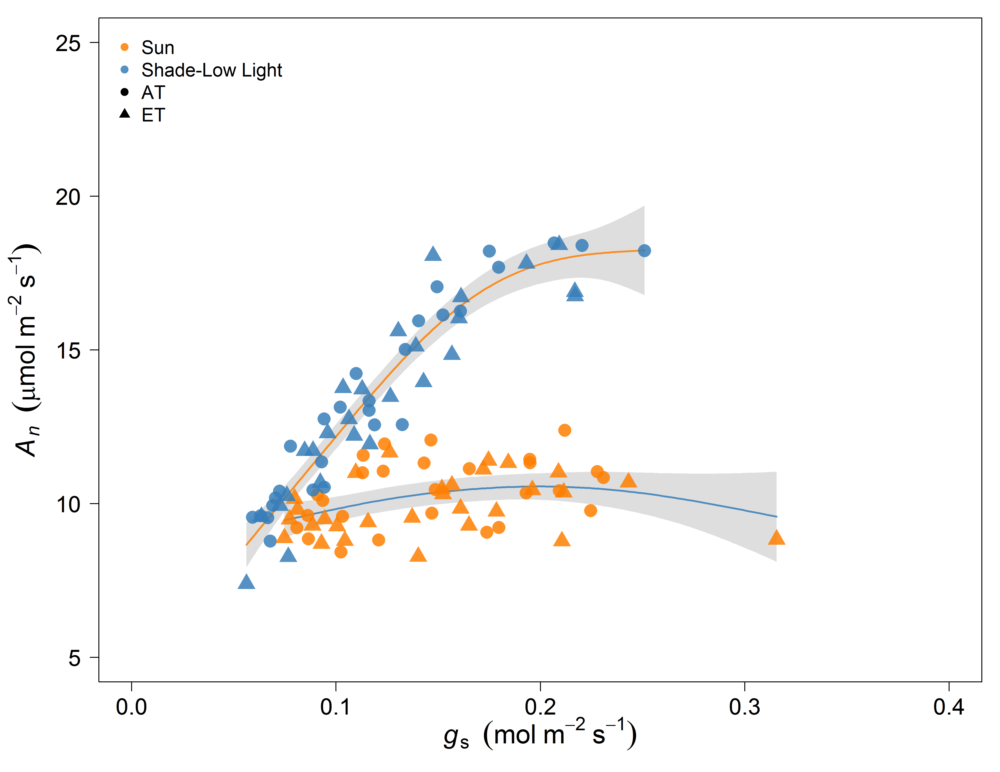
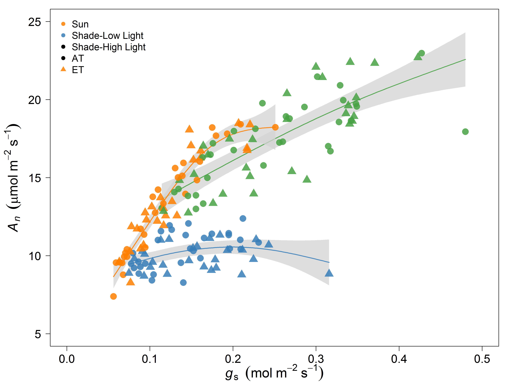
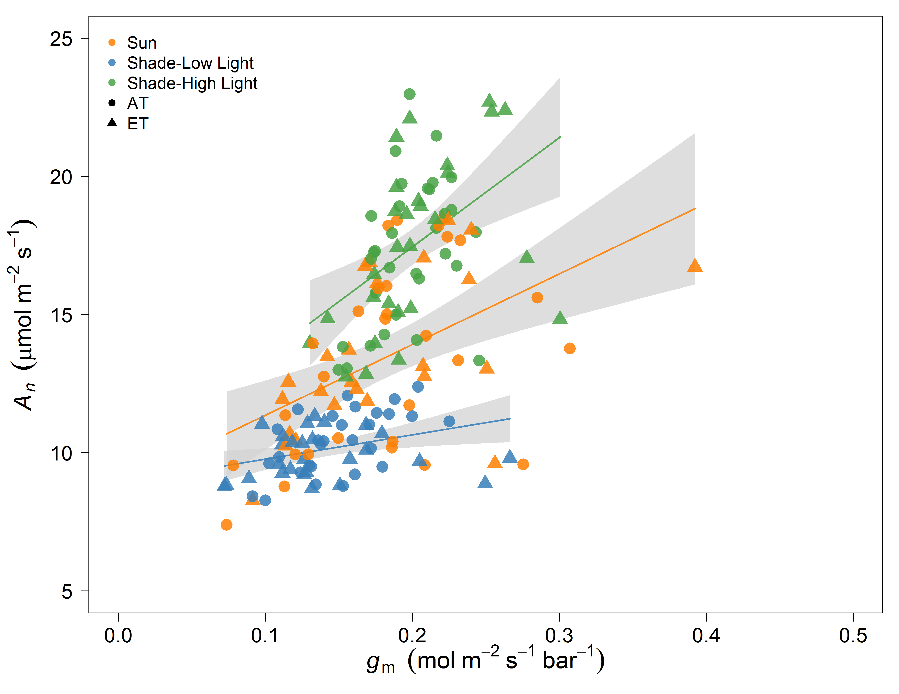
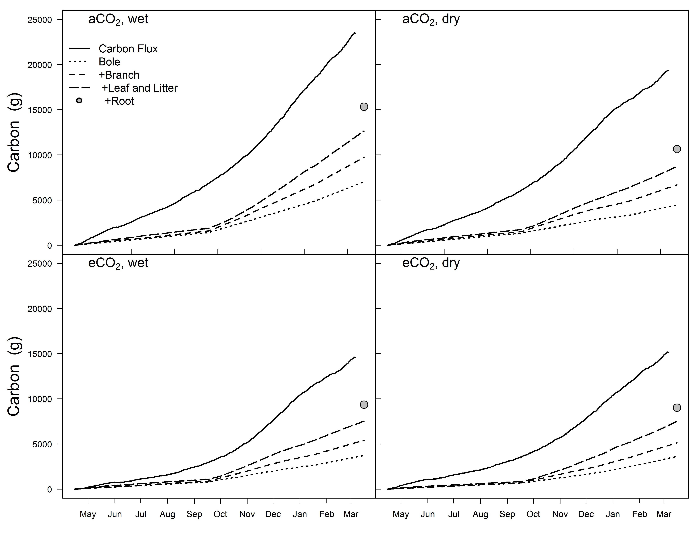

```{r setup, include=FALSE}
knitr::opts_chunk$set(echo = FALSE)
```

## Shade leaves exhibited apparent inefficient water use
<hr>

 

## Does the answer lie within sunflecks?
<hr>



## <strong>↓</strong> WUE from sub-optimal behavior of g<sub>s</sub>
<hr>


## Rapid <strong>↑</strong> in g<sub>m</sub> enables sunfleck response
<hr>



## Is tree C allocation fixed?
<hr>
