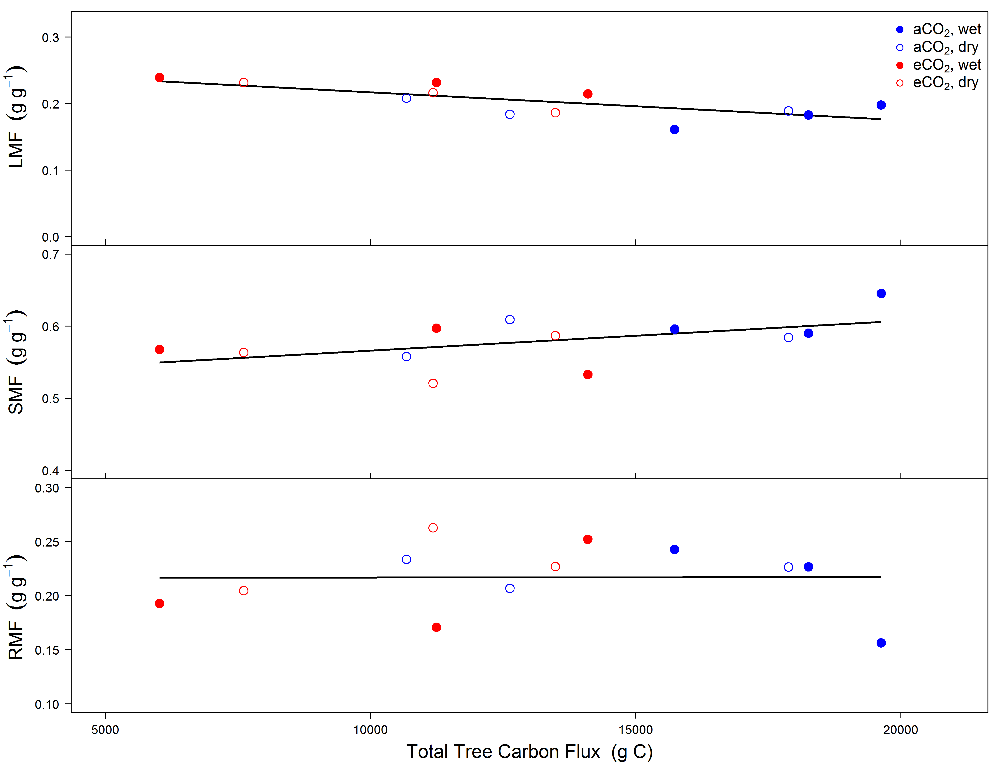

```{r setup, include=FALSE}
knitr::opts_chunk$set(echo = FALSE)
```

## Shade leaves exhibited apparent inefficient water use
<hr>

 

## Does the answer lie within sunflecks?
<hr>


## <strong>↓</strong> WUE from sub-optimal behavior of g<sub>s</sub>
<hr>


## Rapid <strong>↑</strong> in g<sub>m</sub> enables sunfleck response
<hr>


## Is tree C allocation fixed?
<hr>


## LMF <strong>↑</strong> (+15%) and SMF <strong>↓</strong> (-6%) under CO<sub>2</sub>
<hr>



## Whole Tree Chambers Experiments
<hr>
<br />
<br />

* <strong>What they are:</strong>
  + Tools for plant physiological research
  + Excellent manipulative control for global change studies
  + Step beyond container based experiments

  <br />
  <br />
  
* <strong>What they are not:</strong>
  + A proxy for ecosystem level processes
  
 