## About me:
<hr>

<br />
<br />
<br />
<br />

* Plant Ecophysologist  
* Ecosystem Ecologist

<br />

* www.courtneycampany.com  
* twitter @court_campany

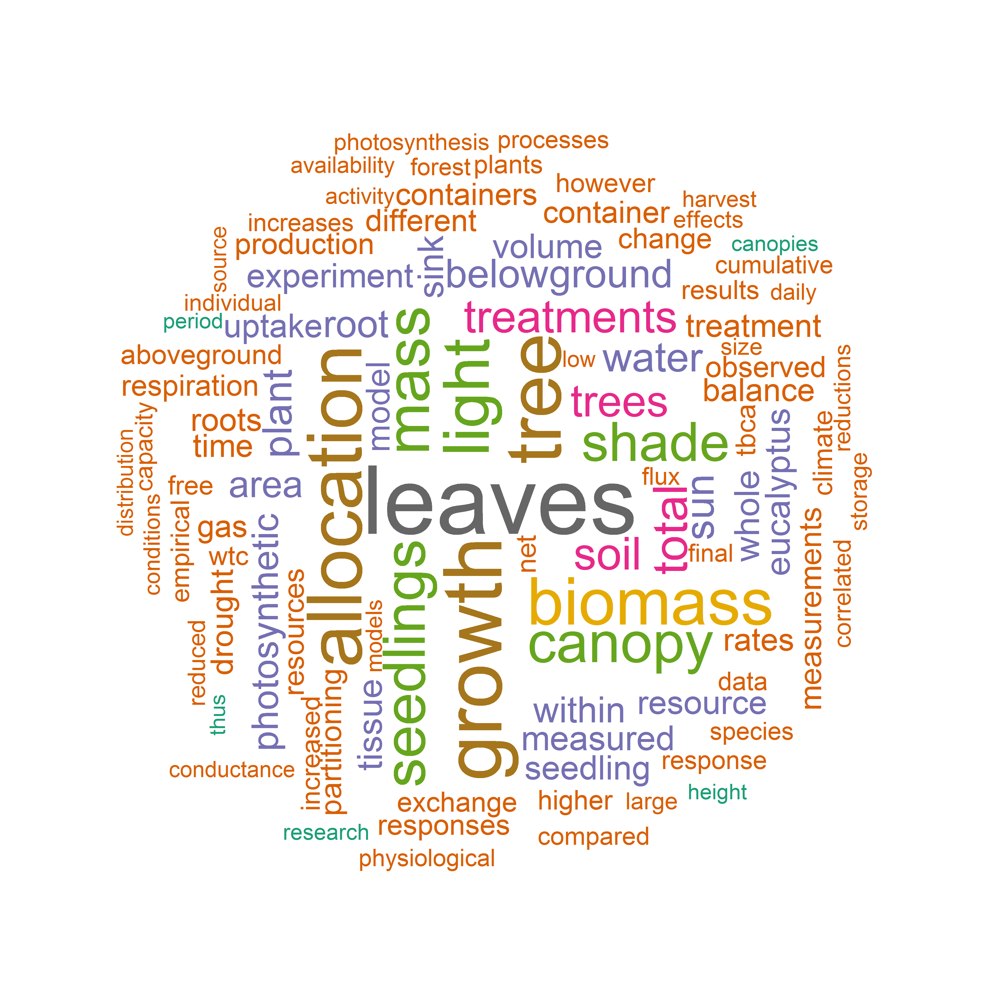

## Science Background
<hr>
```{r echo=FALSE}
library(leaflet)
locations <- read.csv("data/memap.csv")

leaflet() %>% addTiles%>%
      addCircleMarkers(locations[1:nrow(locations),3], 
                 locations[1:nrow(locations),2],
                 popup = locations[1:nrow(locations),1],
                 col=c("red", "gold", "orange", "forestgreen", "navy", "black", "darkgreen",                         rep("darkgreen",19),"#990033"),
                 opacity=c(.85, 100, .85, .85, .85, .85, rep(.85, 21)),
                fillColor = c("white", "black", "white", "white", "grey", "darkgoldenrod", "plum", 
                        "white", rep("white",19)),
                 fillOpacity = c(100, 100, 100, 0, 85, 100, rep(100, 21)), weight=3)
 
```

## Research: Tree carbon uptake and carbon allocation
<hr>
<br />
<br />

* <strong>How are trees optimized for C gain?</strong>
  + Physiology, resource distribution and anatomy
  + Will future global change affect these processes?
  
<br />

* <strong>Where does this C go?</strong>  
  + Fate of photosynthetic C through trees  
  + Source vs sink activity  
  + Providing empirical data to models  
  


## Resource allocation is important at multiple scales
<hr>
<br />

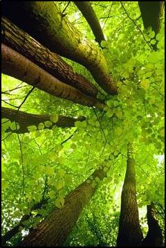

<br />

  + Distribution of H<sub>2</sub>0, N, P regulates leaf photosynthesis
  <br />
  <br />
  
  + Canopy light gradients affect resource distribution 
  <br />
  <br />
  
  + Sum uptake of all leaves determines net canopy C uptake
  <br />
  <br />
  
  + Canopy C must then be allocated, as a resource,  
  to growth, storage and reproduction
  
## Whole Tree Chambers; Hawkesbury Forest Experiment
<hr>
<br />

* <strong>Novel experimental infrastructure with 12 climate controlled chambers</strong>
  + 1 tree per chamber
  + Imported from Sweden, retrofitted to work in Australian climate

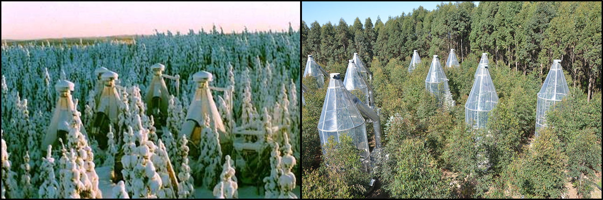

## Whole Tree Chamber Experiments
<hr>
<br />
  
* <strong>Global change manipulations</strong>
  + CO<sub>2</sub>, Precipitation and Warming
  + Interactions between these factors
<br />
<br />
  
* <strong>Excellent environmental control:</strong>
  + Tight control of temperature and RH 
  + CO<sub>2</sub> control allows for <sup>13</sup>C studies to be completed 
<br />
<br />

* <strong>Address tree physiology and tree C allocation questions</strong>
  + Canopy fluxes and canopy access for leaf-scale research
  + Large root enclosure for full biomass harvest
  
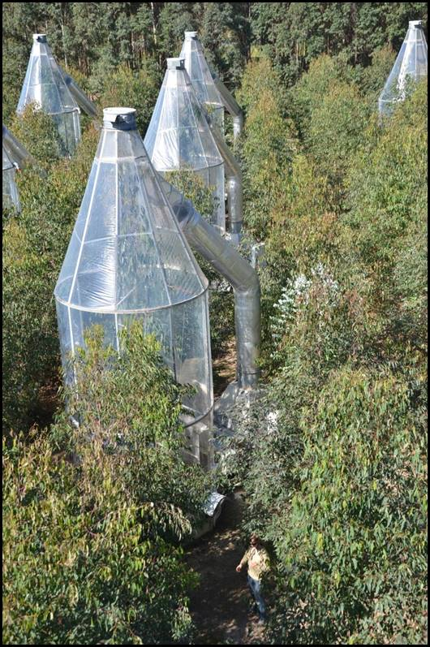  

## Whole Tree Chambers Experiments
<hr>
<br />
<br />

* <strong>What they are:</strong>
  + Tools for plant physiological research
  + Excellent manipulative control of climate change factors
  + Step beyond container based physiology experiments
  + Entire canopy access
  <br />
  <br />
  
* <strong>What they are not:</strong>
  + A proxy for ecosystem level processes
  
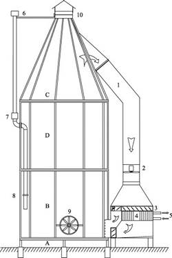

## Research across multiple scales
<hr>
###Dynamic leaf physiology within tree canopies


## Dynamic leaf physiology within tree canopies
<hr>


## Leaves are reported to have an optimized behavior
<hr>

### They should act to maximize carbon gain while minimizing costs 


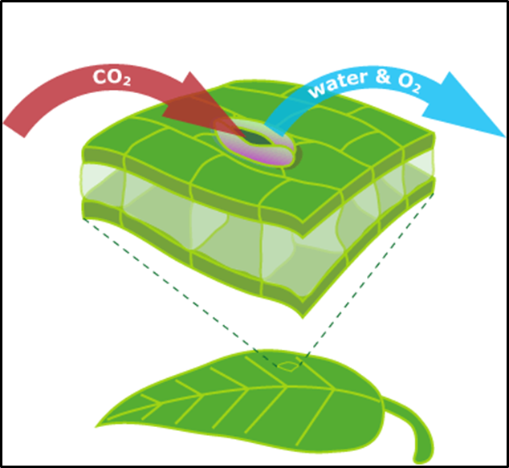

## However...
<hr>
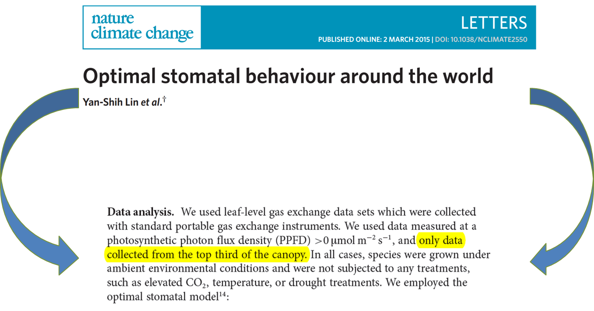

## Are whole canopies optimized for C gain?
<hr>


<br />
<br />
<br />
<br />
<br />
<br />
<br />
<br />
<br />
<br />
<br />
<br />
<br />

+ <strong>Light gradient determines leaf properties</strong>
<br />

+ <strong>N and H<sub>2</sub>O distributed more to sun leaves</strong>
<br />

## For the canopy...Don't <span style="color:green">LEAF</span> things to chance
<hr>
<center></center>
<br />

* <strong>Trees can't put all leaves in the sun</strong>
  + Drives changes in anatomy, morphology and physiology
  + Affects canopy resource distribution

* <strong>Photosynthetic capacity ↓ in shade leaves</strong>

## Photosynthesis is driven by diffusion
<hr>
<br />
<br />

<div style="float: left; width: 50%;">
+ Driven by resistances to CO<sub>2</sub> into leaves and then to the site of carboxylation
<br />

+ Stomatal <strong>(g<sub>s</sub>)</strong> and mesophyll <strong>(g<sub>m</sub>)</strong> conductance both limit photosynthesis 
<br />

+ Limitations result from costs and trade-offs
<br />
<br />
<br />

+ <strong>We know little about these relationships within canopies</strong> 
</div>


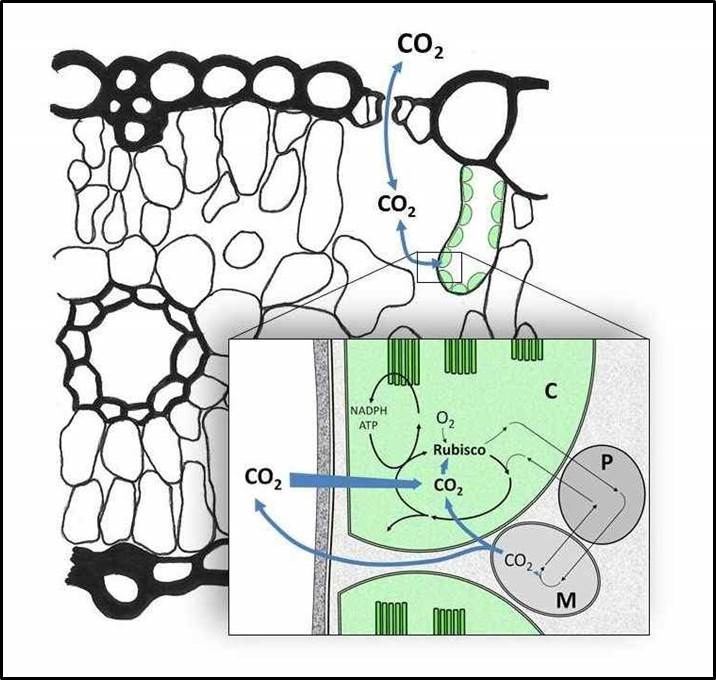


##  Leaves experience light fluctuations daily
<hr>
<br />


<div style="float: right; width: 50%;">
<br />

+ Are shade leaves optimized for low light or to respond to occasional high light?

+ Beyond just photosynthetic capacity
 
+ g<sub>s</sub> responds slowly

+ g<sub>m</sub> anatomically constrained

+ <strong>Unfortunately, not enough empirical data available</strong>

</div>

## WTC3: Resource distribution of *Eucalpytus tereticornis*
<hr>

<div style="float: left; width: 50%;">
<br />
<br />

* <strong>Leaf Nitrogen </strong>
 + Sun & shade leaves from gas exchange

<br />

* <strong>Leaf Hydraulics</strong>
 + Predawn / Midday water potentials
 + Leaf transpiration from gas exchange
 + Leaf specific hydraulic conductance
 
</div> 

<div style="float: right; width: 50%;">
<br />
<br />

* <strong>Water Use Efficiency</strong>
 + ITE = Photosynthesis / Transpiration
 + Bulk leaf<sup>13</sup>C = WUE over leaf lifespan

</div>


## WTC3: Leaf physiology of *Eucalpytus tereticornis*
<hr>


<div style="float: left; width: 50%;">
<br />

* <strong>Climate warming treatment</strong>
 + +3&deg;C ET treatments
 + Minimal treatment effects found  
<br />

* <strong>Imposed drought in final months</strong>
 + Focus on well watered trees  
<br />

* <strong>Gas exchange campaigns over 6 months</strong>
 + Sun and shade leaves
 + Leaf temperature = air temperature
 + Tunable diode laser for g<sub>m</sub>
 
 </div>
 
##  Are tree canopies optimized for carbon gain?
<hr>

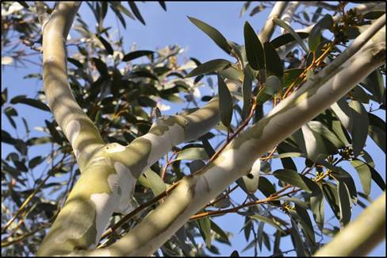

<div style="float: right; width: 50%;">
<br />

* <strong>Do light gradients define leaf properties</strong>
  + Resources and photosynthetic capacity (<strong>A<sub>max</sub></strong>) should be <strong>↑</strong> in sun leaves  
<br />

* <strong>Is the canopy optimized to <strong>↑</strong> C gain while <strong>↓</strong> water loss?</strong>
  + Then g<sub>s</sub> will be  proportional to photosynthesis across all leaves  
<br />

* <strong>What is the role of g<sub>m</sub> as its costs are less clear?</strong>
  + If A<sub>max</sub> is  in sun leaves then <strong>↑</strong>g<sub>m</sub> should be too 
  
 </div> 
 
## What's in a name? That which we call a <span style="color:hotpink">~~Rose~~</span> <span style="color:green">Leaf</span>
<hr>
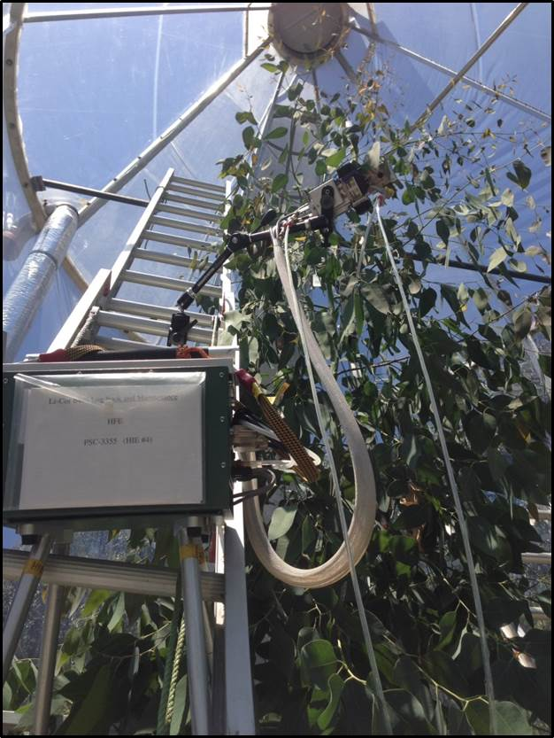
<br />
<br />

* <strong>Measuring two canopy extremes</strong>
 + Sun: top of canopy in full light
 + Shade: bottom and middle canopy in full shade
 + Verified with quantum sensor and ceptometer
 
<br />

* <strong>Leaves measured at current light environment</strong>
 + 'Lights On' for shade leaves
 +  Max sunfleck response (fluxes stable)  
 
## WTC3: Were sun and shade leaves fundamentally different?
<hr> 
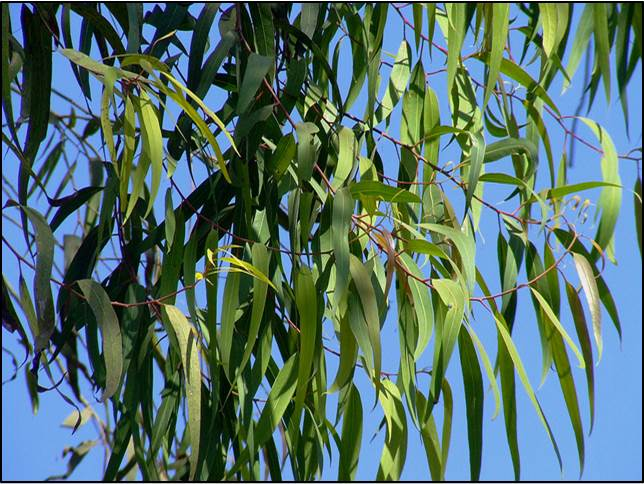

## 75% reduction in direct light to shade leaves
<hr>

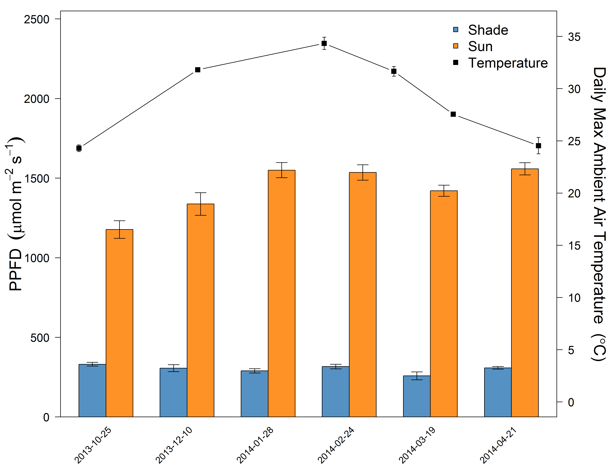


## Photosynthetic capacity and resource distribution
<hr>

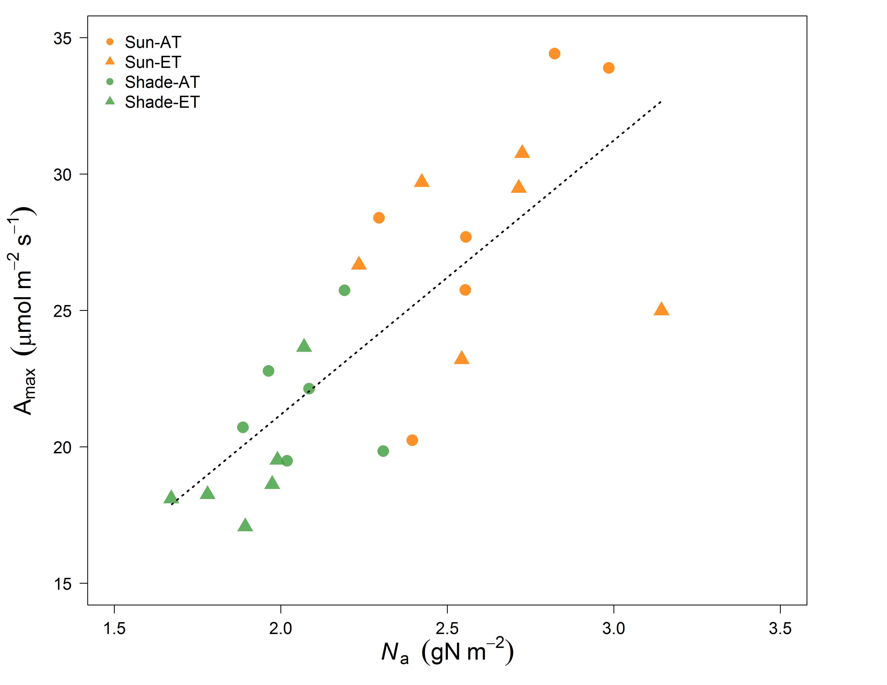

<div style="float: right; width: 30%;">
<br /> 
<br />
<br />


* <strong>A<sub>max</sub> reduced in shade</strong>
<br />

* <strong>25% higher leaf Nitrogen in sun</strong>
<br />

* <strong>44% higher leaf hydraulic conductance in shade?</strong>
<br />

* <strong>Leaf mass area similar</strong>
</div>  
 
## Shade leaves exhibited apparent inefficient water use
<hr>

```{r, echo=FALSE, message=FALSE}
library(shiny)
library(doBy)
library(scales)
library(mgcv)

gmes <- read.csv("data/gmes_wellwatered.csv")
source("data/functions.R")

suncol <- alpha("#ff7f00",0.85) 
shacol <-  alpha("#377eb8", 0.85) 
lightscol <- alpha("#47a244", 0.85) 
allcols=c(suncol, shacol, "black", "black")
alllab <- c("Sun", "Shade-Low Light", "AT", "ET")

###get average by id
gm_agg <- summaryBy(Photo+ Cond + gm_bar ~ chamber+id+leaf +light+temp+leaflight+Month, data=gmes, FUN=mean, keep.names=TRUE)
cond_dat <- gm_agg[, c("leaflight", "Photo", "Cond", "temp")]

leafnames <- unique(cond_dat$leaflight)
leafnames2 <- data.frame(leaflight = leafnames, colorleaf = c(lightscol, shacol, suncol))

cond_dat2 <- merge(cond_dat, leafnames2)
cond_dat2$colorleaf <- as.character(cond_dat2$colorleaf)

shinyApp(
  
  ui = fluidPage(
      titlePanel(""),
      sidebarLayout(
        ##type selection
        sidebarPanel(
        style = "border-color: #cc2904; background-color: white; border-style:dotted;border-width:medium",
        checkboxGroupInput("whichleaf", "Pick a leaf:",c("Sun" = "sun-high", "Shade-low light" =                                      "shade-low"),selected="sun-high")
        ),
  
      mainPanel(
        plotOutput('plot1'))
  )
  ),
  
  server = function(input, output) {
    leaf_ss<- reactive({
      subset(cond_dat2, leaflight %in% input$whichleaf)
      })
    
    output$plot1 <- renderPlot({
      
    palette(c(lightscol, shacol, suncol))
      
    par(mar=c(5,5,1,1),las=1,cex.axis=1.25, cex.lab=1.75)  
    plot(cond_dat2$Photo ~ cond_dat2$Cond,type='n',
           col="blue", ylim=c(5,25), xlim=c(0,.5), xlab=expression(italic(g)[s]~~(mol~m^-2~s^-1)),                    ylab=expression(italic(A[n])~~(mu*mol~m^-2~s^-1)))
           
    legend("topleft", alllab, pch=c(16,16,16,17), col=allcols, inset = 0.01, 
             bty='n',pt.cex=1.5,cex=1.2)
    
    points(leaf_ss()[[2]]~ leaf_ss()[[3]], cex=2, col=leaf_ss()[,1], pch=c(16,17)[leaf_ss()[,4]])
    
  })
  }
)
``` 
 
## <strong>↓</strong> WUE from sub-optimal behavior of g<sub>s</sub>
<hr>

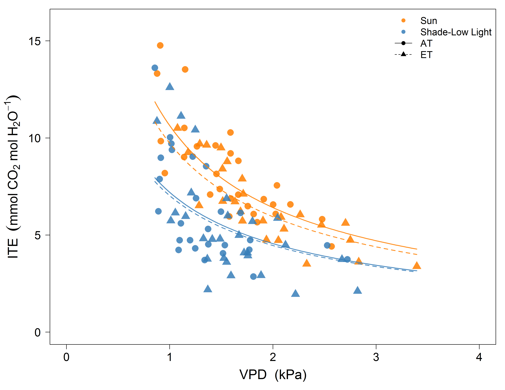


## Does the answer lie within sunflecks?
<hr>

```{r, echo=FALSE, message=FALSE}

allcols2=c(suncol, shacol, lightscol, "black", "black")
alllab2 <- c("Sun", "Shade-Low Light", "Shade-High Light", "AT", "ET")

shinyApp(
  
  ui = fluidPage(
      titlePanel(""),
      sidebarLayout(
        ##type selection
        sidebarPanel(
        style = "border-color: #cc2904; background-color: white; border-style:dotted;border-width:medium",
        checkboxGroupInput("whichleaf", "Pick a leaf:",c("Sun" = "sun-high", "Shade-low light" = "shade-low", "Shade-high light" = "shade-high"))
        ),
  
      mainPanel(
        plotOutput('plot1'))
  )
  ),
  
  server = function(input, output) {
    leaf_ss<- reactive({subset(cond_dat2, leaflight %in% input$whichleaf)
    })
    
    output$plot1 <- renderPlot({
    
    palette(c(lightscol, shacol, suncol))
      
    par(mar=c(5,5,1,1),las=1,cex.axis=1.25, cex.lab=1.75)  
    plot(cond_dat2$Photo ~ cond_dat2$Cond,type='n',
           col="blue", ylim=c(5,25), xlim=c(0,.5), xlab=expression(italic(g)[s]~~(mol~m^-2~s^-1)),                    ylab=expression(italic(A[n])~~(mu*mol~m^-2~s^-1)))
           
    legend("topleft", alllab2, pch=c(16,16,16,16,17), col=allcols2, inset = 0.01, 
             bty='n',pt.cex=1.5,cex=1.2)
    
    points(leaf_ss()[[2]]~ leaf_ss()[[3]], cex=2,  pch=c(16,17)[leaf_ss()[,4]],col=leaf_ss()[,1])
    
  })
  }
)
``` 

## Dynamic physiology: total conductance to CO<sub>2</sub>
<hr>


<div style="float: right; width: 50%;">
<br />
<br />
<br />

> - Stomatal response generally considered slow  

<br />

> - Increases CO<sub>2</sub> in intercellular airspaces, but...  

<br />

> - <strong>Thats not where the magic happens</strong>  

</div> 

##g<sub>m</sub> <strong>↑</strong> ~40% in shade leaves under high light
<hr>

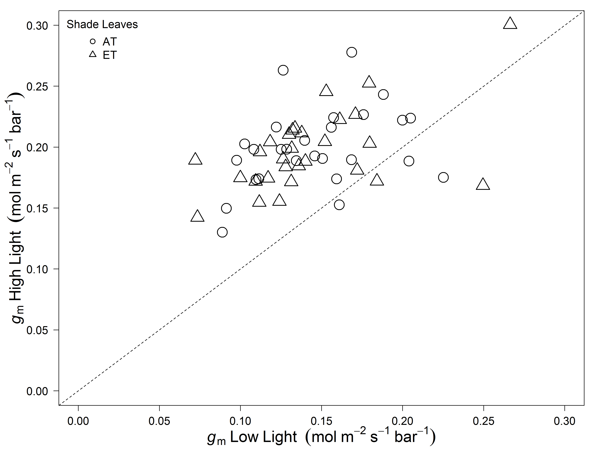

##Rapid <strong>↑</strong> in g<sub>m</sub> enables photosynthetic sunfleck response
<hr>

```{r, echo = FALSE}

gm_dat <- gm_agg[, c("leaflight", "Photo", "gm_bar", "temp")]

gm_dat2 <- merge(gm_dat, leafnames2)
gm_dat2$colorleaf <- as.character(gm_dat2$colorleaf)


shinyApp(
  
  ui = fluidPage(
      titlePanel(""),
      sidebarLayout(
        ##type selection
        sidebarPanel(
        style = "border-color: #cc2904; background-color: white; border-style:dotted;border-width:medium",
        checkboxGroupInput("whichleaf", "Pick a leaf:",c("Sun" = "sun-high", "Shade-low light" =                                      "shade-low", "Shade-high light" = "shade-high"))
        ),
  
      mainPanel(
        plotOutput('plot1'))
  )
  ),
  
  server = function(input, output, session) {
    
    
    leaf_ss<- reactive({
      subset(gm_dat2, leaflight %in% input$whichleaf)
      })
    
    output$plot1 <- renderPlot({
    
    palette(c(lightscol, shacol, suncol))
      
    par(mar=c(5,5,1,1),las=1,cex.axis=1.25, cex.lab=1.75)  
    plot(gm_dat2$Photo ~ gm_dat2$gm_bar,type='n',
           col="blue", ylim=c(5,25), xlim=c(0,.45),                                                                    xlab=expression(italic(g)[m]~~(mol~m^-2~s^-1~bar^-1)),
           ylab=expression(italic(A[n])~~(mu*mol~m^-2~s^-1)))
           
    legend("topleft", alllab2, pch=c(16,16,16,16,17), col=allcols2, inset = 0.01, 
             bty='n',pt.cex=1.5,cex=1.2)
    
    points(leaf_ss()[[2]]~ leaf_ss()[[3]], cex=2,  pch=c(16,17)[leaf_ss()[,4]],col=leaf_ss()[,1])
    
  })
  }
)
```


## Do shade leaves 'lie in wait'?
<hr>

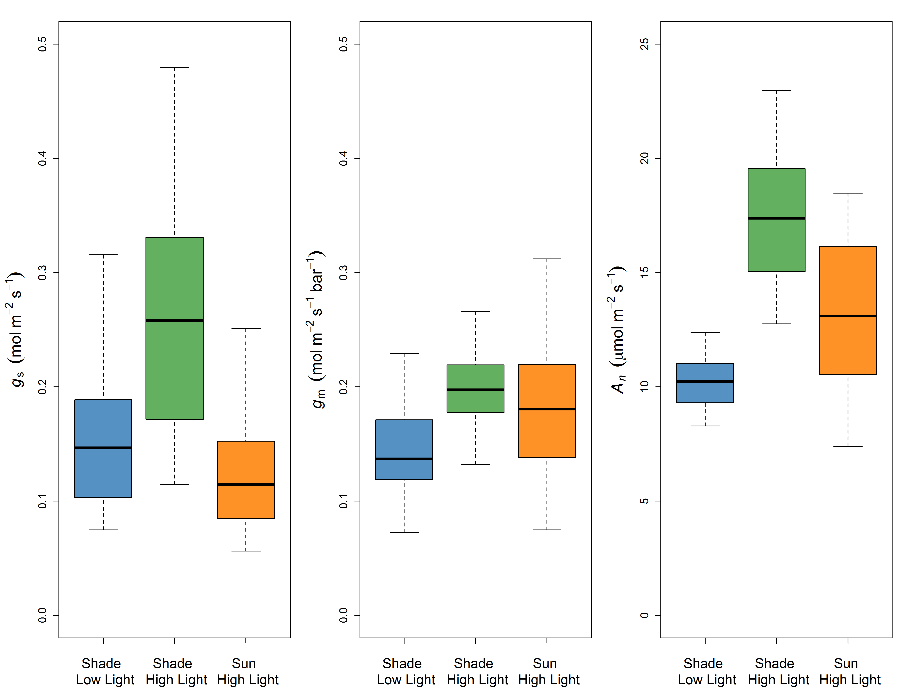
 
 
## Future work:  How general is this response?
<hr>
<br />
<br />

* <strong>Sunfleck research focuses heavily on understory</strong>
  + Enhancing light interception is crucial for canopy C gain, 

<br />

> - <strong>Functional properties of *Eucalpytus* leaves and canopies</strong> 
>  - Vertical leaf angles
>  - Stomata on both sides of the leaf
>  - Sparse canopies 
>  - Everygreen: year round C gain 

## Moving forward: leaf to canopy economic spectrum
<hr>


<div style="float: right; width: 50%;">
<br />
<br />

* <strong>How do trees optimize canopy C gain</strong>

>  - Resource distribution
>  - Dynamic leaf physiology (g<sub>m</sub>)
>  - Anatomy

<br />

> - <strong>Implications for scaling up leaf level measurments</strong>

</div> 

## Canopy C fluxes and whole tree C allocation
<hr>


## Background: modeling C allocation is a hot issue
<hr>

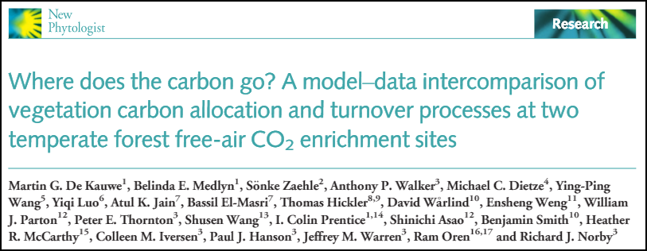

## Background: modeling C allocation is a hot issue
<hr>

<br />
<br />

* <strong>Requires knowledge of global change impacts on forest ecosystems</strong>

>  - How is net canopy C gain affected?
>  - What components of allocation are most affected?

<br />

* <strong>Allocation schemes are necessary to constrain models</strong>

>  - Is tree C allocation fixed or dymanic?

## Strong focus on belowground C allocation (TBCA)
<hr>
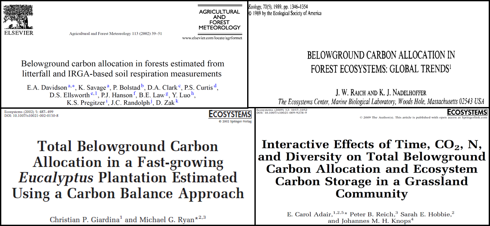


## TBCA and global change: FACE studies
<hr>
<br />
<br />
<br />
<br />
<br />
<br />
<br />
<br />
<br />
<br />
<br />
<br />
<br />
<br />

* <strong>TBCA enhanced under eCO<sub>2</sub></strong>
  + Fine roots (Iversen et al. 2010)
  + Exudation (Phillips et al. 2011)

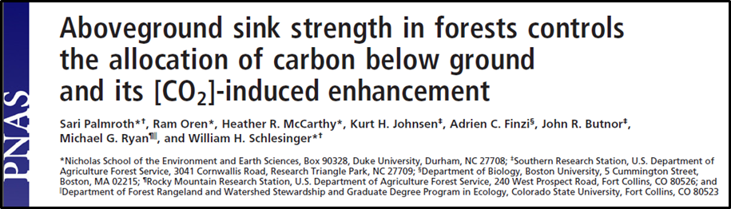

## Relevant drawbacks to these study
<hr>
<br />

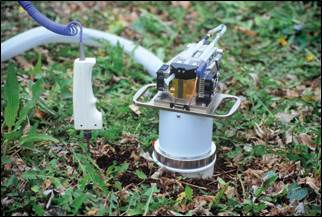

* <strong>TBCA needs to be estimated as a residual</strong>

>  -  Soil respiration - C pools of litter, soils and roots
>  -  Assumes steady-state conditions

<br />

* <strong>Soil respiration scaled up</strong>

>  -  Point measurements (monthly) to yearly fluxes

<br />

> - <strong>TBCA is really hard to estimate</strong>


## Can the WTC provide a better empirical solution?
<hr>

<div style="float: right; width: 50%;">

<br />
<br />
<br />
<br />

* <strong>High resolution C and H<sub>2</sub>0 fluxes (14 min)</strong>
<br />
<br />

* <strong>Ability to track/harvest biomass</strong>
<br />
<br />

* <strong>Separation of soil respiratory flux</strong>
</div>

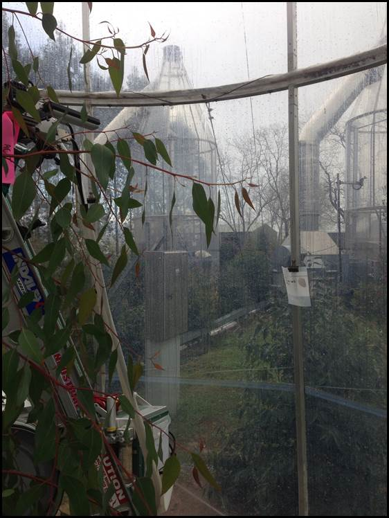


## WTC: Mass balance approach
<hr>


## WTCI: CO<sub>2</sub> x Drought with *Eucalpytus saligna*
<hr>
<br />
<br />

* <strong> *Eucalpytus saligna* or Sydney blue gum</strong>
  + Important global plantation species
  + Utilized in numerous climate change manipulation studies

<br />

* <strong>Full factorial treatment design</strong>
  + 6 WTC at ambient CO<sub>2</sub> of 380 ppm and 6  at eCO<sub>2</sub> of +240 ppm above ambient
  + 4 month drought (no watering) during chamber flux period

## WTC1: Whole Tree CO<sub>2</sub> flux
<hr>
<br />
<br />

* <strong>Hybrid open-mode - null-balance gas exchange system</strong>
  + 30m<sup>3</sup> air volume, fresh air supply at 10L s<sup>-1</sup>
  + Pure CO<sub>2</sub> injected to reach target
  + IRGA samples every 60 sec (14 min cycle all WTCs/2 reference lines)

<br />

* <strong>CO<sub>2</sub> flux from mass balance of CO<sub>2</sub> entering and leaving the chamber with chamber ventilation</strong>

## Calculating tree C allocation
<hr>
<br />

* <strong>Once trees are large enough, chamber floors installed and chamber fluxes measured</strong>

>  - Continuous aboveground C fluxes over 11 months  

<br />

* <strong>Allometric surveys fortnightly</strong>

>  - Height and diameter measurements, 
>  - Leaf litter collection and leaf counts
>  - Branch counts and lengths 

<br />

* <strong>Biomass harvest by structural components</strong>

>  - Density of branches, bole wood, bark
>  - Specific leaf area (SLA)

## Component C allocation with mass balance
<hr>

<br />

* <strong>Harvest</strong>

>  - C content = 50% of dry biomass
>  - TBCA = Cumulative CO<sub>2</sub> flux  - mass of Branch + Bole + Leaves
>  - TBCA - Root mass = Root turnover + exudation + microbial respiration

<br />

* <strong>Daily time steps</strong>

>  - Cumulative CO<sub>2</sub> flux per time step
>  - Volume and density to calculate wood mass</strong>
>  - Modelled leaf area (daily) and SLA to predict leaf mass

<br />

* <strong>To what degree is C allocation fixed under global change?</strong>

## 1<sup>st</sup> Step: Defining C allocation
<hr>
<br />
<br />
<br />

* <strong>*Mass partitioning*:  the relative distribution of biomass between different tree tissue components such as leaves, branches, bole and roots.</strong>

<br />

* <strong>*Carbon allocation*: the fraction of canopy photosynthesis distributed to different components such as tissue biomass pools, respiratory C fluxes, non-structural carbohydrate storage pools or root C exudation.</strong>

## 2<sup>nd</sup> Step: Differentiating between the two
<hr>
<br />

* <strong>Changes in C allocation encompass effects of tissue turnover, the storage and use of carbohydrates and root exudation</strong>

 > - Each represents a significant responses to environmental change.
 > - Patterns in biomass partitioning and C allocation may not be consistent  
 > - Contributes to the current uncertainty in modelling tree growth responses global change

<br />

* <strong>Tissue specific C allocation represents the fraction of net canopy C uptake distributed to a given tissue</strong>

 > - WTC1: Leaf<sub>m</sub> = Leaf<sub>a</sub> * Canopy Flux C - Leaf<sub>t</sub>)
 > - Solve for allocation
 > - WTC1:  Leaf<sub>a</sub> = (Leaf<sub>m</sub> - Leaf<sub>t</sub>) / Canopy Flux C 
 
## WTC: Canopy C uptake to component allocation
<hr>

 
 
## Leaf area reduced in CO<sub>2</sub>
<hr>
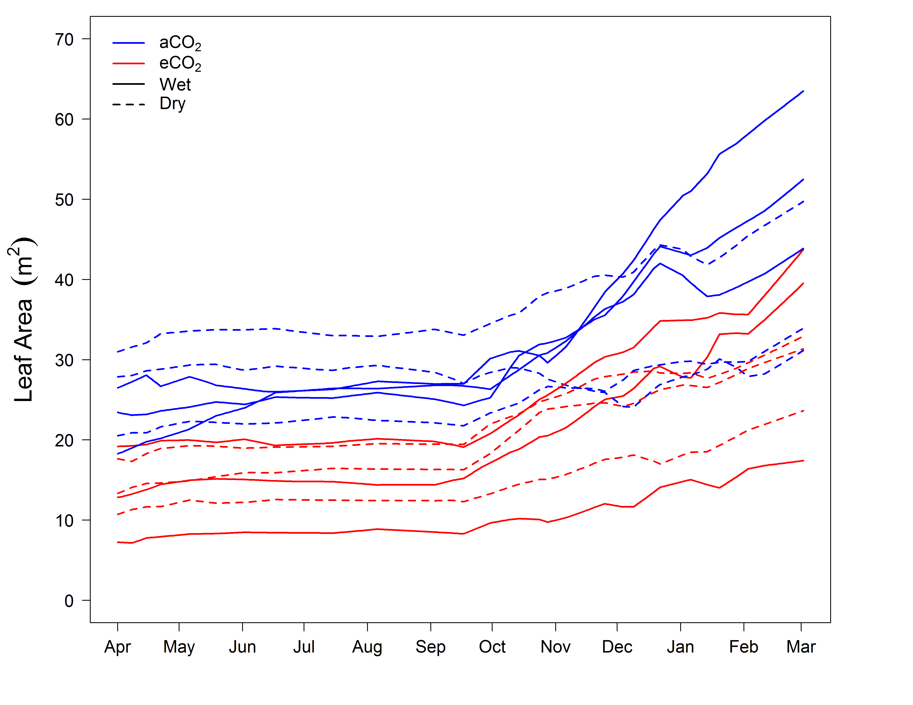

## Leaf area and  tree C uptake strongly related
<hr>

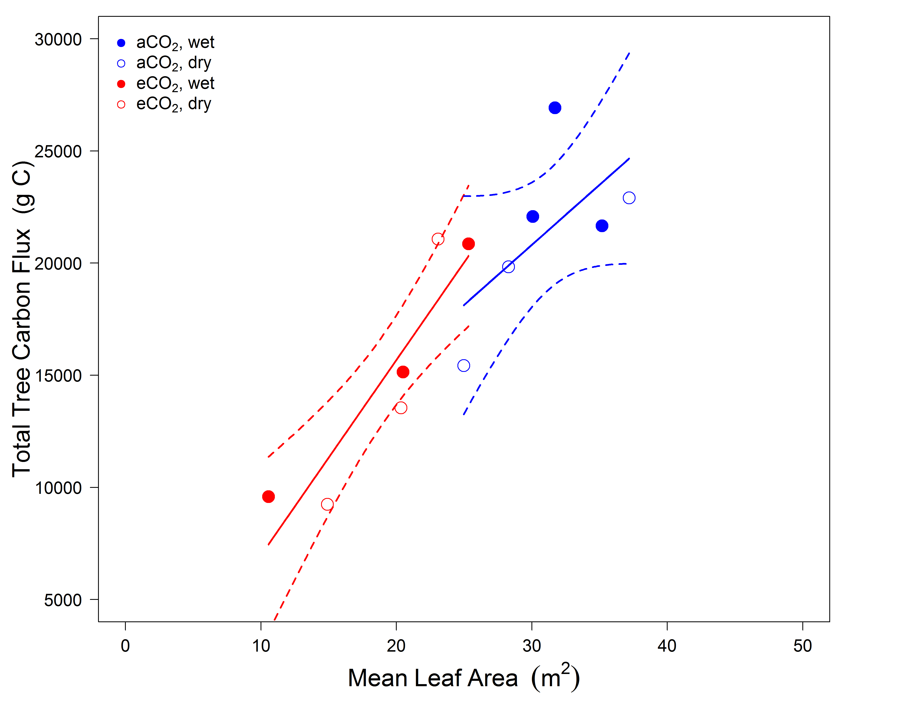

## Leads to similar reduction in harvested mass
<hr>

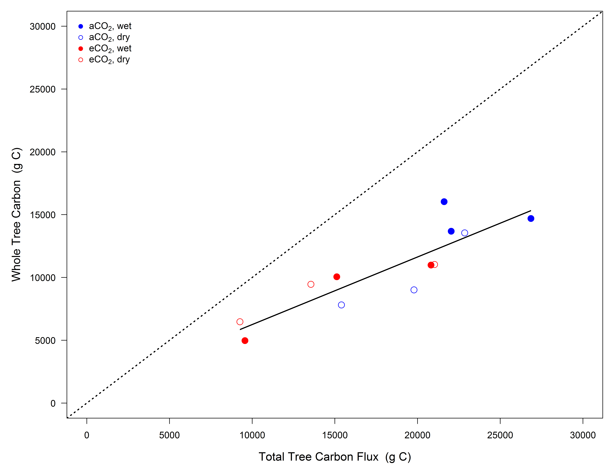

## Relationship between tree C flux and biomass
<hr>
<br />
<br />

* <strong>Difficult to empirically measure</strong>
  + Shown to be poorly related (Litton et al. 2007)

<br />

* <strong>Advantages of WTC</strong>
  + Allows testing of the coordination of canopy photosynthesis and growth
  + Can examine over longer time periods
  + <strong>strongly correlated over 2.5 fold size range in *Eucalyptus* trees</strong>

## LMF <strong>↑</strong> (+15%) under CO<sub>2</sub> while SMF <strong>↓</strong> (-6%) 
<hr>


```{r massfractions, echo=FALSE, message=FALSE}
library(plotrix)
massfrac <- read.csv("data/chamber_carbon.csv")

  massfrac$standingtreemass <- with(massfrac, treeC-littercarbon)
  ##calculated component fractions
  massfrac$lmf <- with(massfrac, leafcarbon/standingtreemass)
  massfrac$smf <- with(massfrac, (boleC+branchC)/standingtreemass)
  massfrac$rmf <- with(massfrac, (rootC)/standingtreemass)
  ##order by treatment
  massfrac$treatment <- with(massfrac, paste(CO2_treatment, Water_treatment, sep="-"))  
  massfrac <- massfrac[order(massfrac$treatment),]

#simple mode for abline and sig
lmfmod <- lm(lmf ~ standingtreemass, data = massfrac)
smfmod <- lm(smf~ standingtreemass, data = massfrac)
rmfmod <- lm(rmf ~ standingtreemass, data = massfrac)

modresults <- data.frame(lmf = c(coef(lmfmod[1]), coef(lmfmod[2])), smf = c(coef(smfmod[1]), coef(smfmod[2])), rmf = c(coef(rmfmod[1]), coef(rmfmod[2])))

# plot bits ---------------------------------------------------------------

leglab2 = c(expression(paste(aCO[2], ", " ,"wet")), expression(paste(aCO[2], ", " ,"dry")),
            expression(paste(eCO[2], ", " ,"wet")), expression(paste(eCO[2], ", " ,"dry")))

fraclab <- expression(Component~Mass~Fraction~~(g~g^-1))

# plotting ----------------------------------------------------------------

shinyApp(
  
ui = fluidPage(
      titlePanel(""),
      sidebarLayout(position="right",
        ##type selection
        sidebarPanel(
        style = "border-color: #cc2904; background-color: white; border-style:dotted;border-width:thick",
        radioButtons("whichcomponent", "Pick a component:",c("LMF" = "lmf", "SMF" = "smf", "RMF" =                              "rmf"))
        ),
  
      mainPanel(
        plotOutput('plot1'))
  )
  ),
  
server = function(input, output, session) {

    
    component_ss <- reactive({
      massfrac[, c("standingtreemass",input$whichcomponent,"Water_treatment","CO2_treatment")]
    })
    
    mod_ss <- reactive({
      modresults[,input$whichcomponent]
    })
    
output$plot1 <- renderPlot({

palette(c("blue", "red"))
par(mar=c(5,6,1,1),las=1, cex.axis=1, cex.lab=1.25, mgp=c(3,1,0))
  
plot(massfrac$smf~massfrac$standingtreemass, ylim=c(0, .75), xlim=c(5000,21000), 
     xlab="Tree Biomass (g C)", ylab=fraclab, type='n') 

points(component_ss()[[2]] ~ component_ss()[[1]], cex=2, pch=c(1,19)[component_ss()[,3]], 
        col=c(rep("blue",6), rep("red", 6)))
        #col=component_ss()[,4])  #this doesnt work because of multiple column selection with input

ablineclip(mod_ss(), x1=min(component_ss()[[1]]), x2=max(component_ss()[[1]]),lwd=2) 
legend("topleft", leglab2, pch=c(19,1, 19, 1), col=c("blue", "blue", "red", "red"), bty='n')  

  })
  }
)
```


## C allocation to leaves increased under CO<sub>2</sub> (+28%)
<hr>

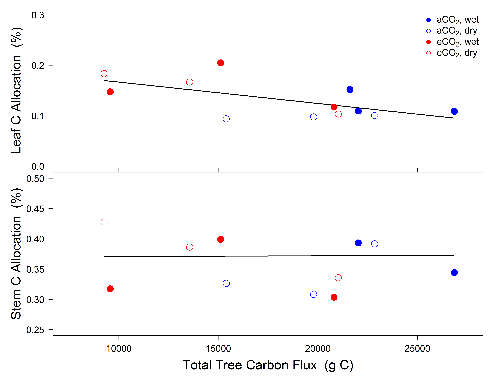

## TBCA ~50%
<hr>
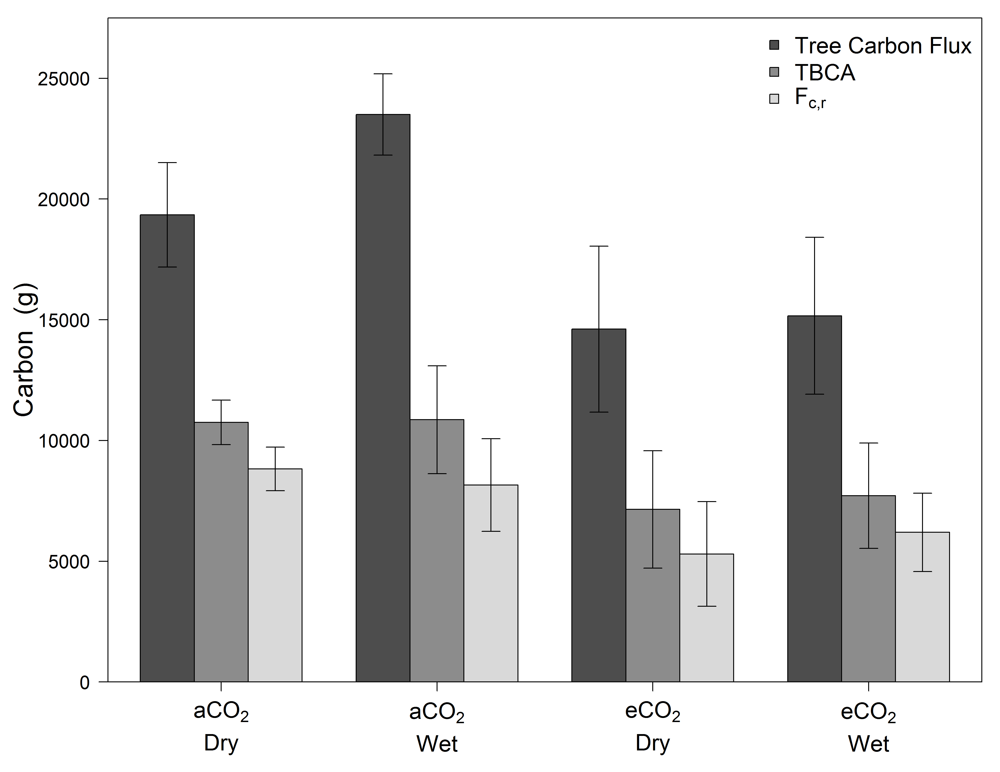


## Is tree C allocation fixed?
<hr>

```{r, echo=FALSE, message=FALSE}
treeC <- read.csv("data/Cflux_day_trt.csv")
  treeC$Date <- as.Date(treeC$Date)
  treeC$bolebranch <- with(treeC, boleC+branchC)

treeC$treatment <- with(treeC, paste(CO2_treatment,Water_treatment, sep="-"))


roots <- read.csv("data/roots_shinyapp.csv")
  roots$Date <- as.Date(roots$Date)

#plot bits
xAT <- seq.Date(from=as.Date("2008-4-1"), length=13, by="month")
LWD <- 2 
dayClab <- c("Carbon Flux", "Bole", "+Branch", " +Leaf and Litter", "  +Root")

shinyApp(
  
ui = fluidPage(
      titlePanel(""),
      sidebarLayout(position="right",
        ##type selection
        sidebarPanel(
        style = "border-color: #cc2904; background-color: white; border-style:dotted;border-width:medium",
        radioButtons("whichtreatment", "Pick a treatment:",c("aCO2-dry" = "ambient-dry", "aCO2-wet" = "ambient-wet", "eCO2-dry" = "elevated-dry", "eCO2-wet" = "elevated-wet"), selected="ambient-wet"),
        width=3
        ),
  
      mainPanel(width=9,
        plotOutput('plot1'))
  )
  ),
  
server = function(input, output) {
    
    flux_ss<- reactive({
      subset(treeC, treatment %in% input$whichtreatment)
      })

    roots_ss<- reactive({
      subset(roots, treatment %in% input$whichtreatment)
      })
    
    
output$plot1 <- renderPlot({

par(mar=c(3,5,1,1))        
plot(fluxC ~ Date, data = treeC,axes=FALSE, xlab="", ylab="Carbon  (g)", ylim=c(0, 25000),type='n')
   points(flux_ss()[[8]] ~ flux_ss()[[1]],lwd=LWD,type = 'l',lty=1)
   points(flux_ss()[[4]] ~ flux_ss()[[1]],lwd=LWD,type = 'l',lty=3)
   points(flux_ss()[[10]] ~ flux_ss()[[1]], lwd=LWD,type = 'l',lty=2)
   points(flux_ss()[[9]] ~ flux_ss()[[1]], lwd=LWD,type = 'l',lty=5)
   points(roots_ss()[[5]] ~ roots_ss()[[3]], pch = 21, bg = "grey", cex=2)
box()
axis.Date(1, at = xAT, labels = TRUE)
axis(2, labels=TRUE)
legend(x=13975, y=25300, dayClab, lty = c(1, 3, 2, 5, -1), pch = c(-1, -1, -1, -1, 21),lwd=LWD,  
        bty='n', pt.cex=1.5,cex=1.2, pt.bg=c(-1, -1, -1, -1,"grey"))

  })
  }
)
```

## Is tree C allocation fixed?
<hr>
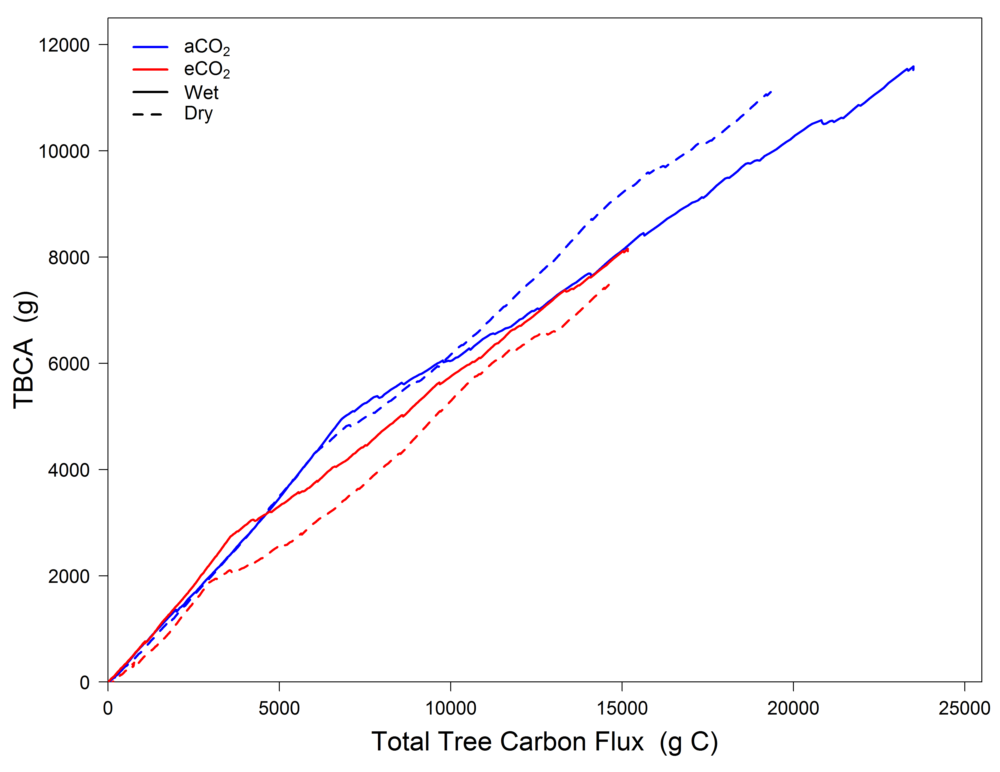

## Conclusions: Tree C allocation, getting it right
<hr>
<br />
<br />

* <strong>How should C allocation be represented in process-based forest models</strong>

> - Empirically defined C allocation patterns constrained by functional relationships with biomass production are needed to reduce uncertainty and improve model predictions (De Kauwe et al 2014)
> - Even if TBCA doesnt change, belowground components still can

<br />
 
* <strong>Measuring biomass just not enough</strong>

> - Here, insufficient to explain responses of tree growth to eCO<sub>2</sub>

## Conclusions: Understanding canopy C gain
<hr>

<div style="float: right; width: 50%;">

<br />
<br />
<br />
<br />
<br />

* <strong>Estimated canopy uptake crucial</strong>

 > - Relates strongly to tree growth
 > - Scaling up is not simple 
 > - Sensitivity to environment at multiple scales

</div>  

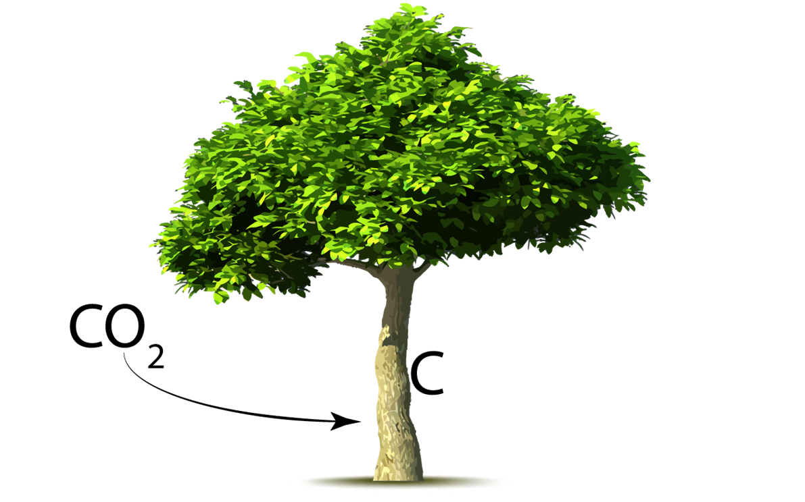

## Conclusions: C allocation from leaf to tree
<hr>

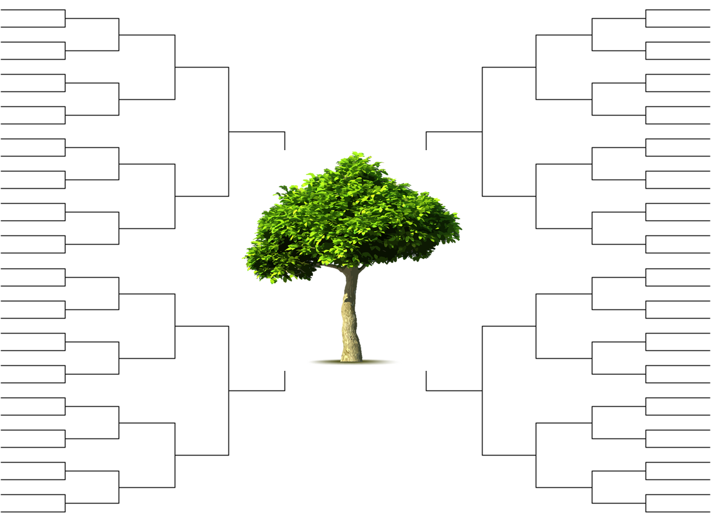
<br />
<br />
<br />
<br />
<br />
<br />
<br />
<br />
<br />
<br />
<br />
<br />
<br />
<br />
<br />
<br />
<br />
<br />

<strong> Quantifying the investment of photosynthetic C is key to assessing tree growth responses</strong>


## Reproducibility
<hr>
<br />
<br />

* <strong>Code for this talk can be found @ https://github.com/CourtneyCampany/seminar_wholetreechamber</strong>

<br />

* data & analysis for WTC1: github.com/CourtneyCampany/WTC1
* data & analysis for WTC3: github.com/CourtneyCampany/WTC_tree


## 


