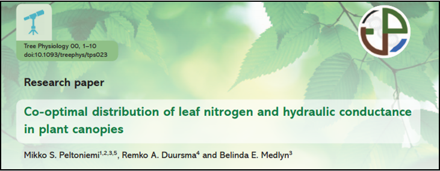

## About me:
<hr>

<br />
<br />
<br />
<br />

* Plant Ecophysologist  
* Ecosystem Ecologist

<br />

* www.courtneycampany.com  
* twitter @court_campany


## Shade leaves exhibited apparent inefficient water use
<hr>

```{r, echo=FALSE, message=FALSE}
library(shiny)
library(doBy)
library(scales)
library(mgcv)

gmes <- read.csv("data/gmes_wellwatered.csv")
source("data/functions.R")

suncol <- alpha("#ff7f00",0.85) 
shacol <-  alpha("#377eb8", 0.85) 
lightscol <- alpha("#47a244", 0.85) 
allcols=c(suncol, shacol, lightscol, "black", "black")
alllab <- c("Sun", "Shade-Low Light", "Shade-High Light", "AT", "ET")

###get average by id
gm_agg <- summaryBy(Photo+ Cond + gm_bar ~ chamber+id+leaf +light+temp+leaflight+Month, data=gmes, FUN=mean, keep.names=TRUE)
cond_dat <- gm_agg[, c("leaflight", "Photo", "Cond")]

leafnames <- unique(cond_dat$leaflight)
leafnames2 <- data.frame(leaflight = leafnames, colorleaf = c(lightscol, shacol, suncol))

cond_dat2 <- merge(cond_dat, leafnames2)
cond_dat2$colorleaf <- as.character(cond_dat2$colorleaf)

palette(c(lightscol, shacol, suncol))

shinyApp(
  
  ui = fluidPage(
      titlePanel("Photosynthesis vs Stomatal Conductance"),
      sidebarLayout(
        ##type selection
        sidebarPanel(
        checkboxGroupInput("whichleaf", "Pick a leaf:",c("Sun" = "sun-high", "Shade -low light" = "shade-low"),selected="sun-high")
        ),
  
      mainPanel(
        plotOutput('plot1'))
  )
  ),
  
  server = function(input, output) {
    leaf_ss<- reactive({
      subset(cond_dat2, leaflight %in% input$whichleaf)[,-4]
      })
    
    # leaf.color <- reactive({
    #   unique(subset(cond_dat2, leaflight %in% input$whichleaf)[,-c(2,3)])
    #   })
    
    output$plot1 <- renderPlot({
      
      plotdat <- leaf_ss()
    
    plot(cond_dat2$Photo ~ cond_dat2$Cond,type='n',
           col="blue", ylim=c(5,25), xlim=c(0,.5),                                                     xlab=expression(italic(g)[s]~~(mol~m^-2~s^-1)),
           ylab=expression(italic(A[n])~~(mu*mol~m^-2~s^-1)))
           
    legend("topleft", alllab, pch=c(16,16,16,16,17), col=allcols, inset = 0.01, 
             bty='n',cex=.8)
    
    points(leaf_ss()[[2]]~ leaf_ss()[[3]], cex=2, pch=21, bg=(leaf_ss()[,1]))
    
  })
  }
)
```

##Rapid <strong>↑</strong> in g<sub>m</sub> enables sunfleck response
<hr>

```{r, echo = FALSE}

gm_dat <- gm_agg[, c("leaflight", "Photo", "gm_bar")]

gm_dat2 <- merge(gm_dat, leafnames2)
gm_dat2$colorleaf <- as.character(gm_dat2$colorleaf)


shinyApp(
  
  ui = fluidPage(
      titlePanel("Photosynthesis vs Stomatal Conductance"),
      sidebarLayout(
        ##type selection
        sidebarPanel(
        checkboxGroupInput("whichleaf", "Pick a leaf:",c("Sun" = "sun-high", "Shade -low light" = "shade-low", "Shade -high light" = "shade-high"),selected="sun-high")
        ),
  
      mainPanel(
        plotOutput('plot1'))
  )
  ),
  
  server = function(input, output) {
    leaf_ss<- reactive({
      subset(gm_dat2, leaflight %in% input$whichleaf)[,-4]
      })
    
    output$plot1 <- renderPlot({
    
    plot(gm_dat2$Photo ~ gm_dat2$gm_bar,type='n',
           col="blue", ylim=c(5,25), xlim=c(0,.5),                                                     xlab=expression(italic(g)[m]~~(mol~m^-2~s^-1~bar^-1)),
           ylab=expression(italic(A[n])~~(mu*mol~m^-2~s^-1)))
           
    legend("topleft", alllab, pch=c(16,16,16,16,17), col=allcols, inset = 0.01, 
             bty='n',cex=.8)
    
    points(leaf_ss()[[2]]~ leaf_ss()[[3]], cex=2, pch=21, bg=(leaf_ss()[,1]))
    
  })
  }
)
```

## Science Background
<hr>
```{r echo=FALSE}
library(leaflet)
locations <- read.csv("data/memap.csv")
locations_usa <- locations[1:6,]

leaflet() %>% addTiles%>%
      addCircleMarkers(locations_usa[1:nrow(locations_usa),3], 
                 locations_usa[1:nrow(locations_usa),2],
                 popup = locations_usa[1:nrow(locations_usa),1],
                 col=c("red", "gold", "orange", "forestgreen", "navy", "black"),
                 opacity=c(.85, 100, .85, .85, .85, .85),
                fillColor = c("white", "black", "white", "white", "grey", "darkgoldenrod"),
                 fillOpacity = c(100, 100, 100, 0, 85, 100), weight=3)
 
```

## Research: Tree carbon uptake and carbon allocation
<hr>
<br />
<br />

* <strong>How are trees optimized for C gain?</strong>
  + Physiology, resource distribution and anatomy
  + Will future global change affect these processes?
  
<br />

* <strong>Where does this C go?</strong>  
  + Fate of photosynthetic C through trees  
  + Source vs sink activity  
  + Providing empirical data to models  
  


## Resource allocation is important at multiple scales
<hr>
<br />


<br />

  + Distribution of H<sub>2</sub>0, N, P regulates leaf photosynthesis
  <br />
  <br />
  
  + Canopy light gradients affect resource distribution 
  <br />
  <br />
  
  + Sum uptake of all leaves determines net canopy C uptake
  <br />
  <br />
  
  + Canopy C must then be allocated, as a resource,  
  to growth, storage and reproduction
  
## Whole Tree Chambers; Hawkesbury Forest Experiment
<hr>
<br />

* <strong>Novel experimental infrastructure with 12 climate controlled chambers</strong>
  + 1 tree per chamber
  + Imported from Sweden, retrofitted to work in Australian climate


## Whole Tree Chamber Experiments
<hr>
<br />
  
* <strong>Global change manipulations</strong>
  + CO<sub>2</sub>, Precipation and Warming
  + Interactions between these factors
<br />
<br />
  
* <strong>Excellent environmental control:</strong>
  + Tight control of temperature and RH 
  + CO<sub>2</sub> control allows for <sup>13</sup>C studies to be completed 
<br />
<br />

* <strong>Address tree physiology and tree C allocation questions</strong>
  + Canopy fluxes and canopy access for leaf-scale research
  + Large root enclosure for full biomass harvest
  
  

## Whole Tree Chambers Experiments
<hr>
<br />
<br />

* <strong>What they are:</strong>
  + tools for plant physiological research
  + excellent manipulative control of climate change factors
  + a step beyond seedling based physiology experiments
  + access to entire canopy
  <br />
  <br />
  
* <strong>What they are not:</strong>
  + a proxy for ecosystem level processes
  


## Research across multiple scales
<hr>
###Dynamic leaf physiology within tree canopies


## Coupled response of stomatal and mesophyll conductance to light enhances photosynthesis of shade leaves under sunflecks
<hr>

<br />
<br />
<br />
<br />
<br />
<br />
<br />
<br />
<br />
<br />

Courtney E. Campany
<br />
Mark G. Tjoelker 
<br />
Susanne von Caemmerer 
<br />
Remko A. Duursma

## Leaves are reported to have an optimized behavior
<hr>

### They should act to maximize carbon gain while minimizing costs 


## However...
<hr>


## Are whole canopies optimized for C gain?
<hr>



<br />
<br />
<br />
<br />
<br />
<br />
<br />
<br />
<br />
<br />
<br />
<br />
<br />

+ <strong>Light gradient determines leaf properties</strong>
<br />

+ <strong>N and H<sub>2</sub>O distributed more to sun leaves</strong>
<br />

## For the canopy...Don't <span style="color:green">LEAF</span> things to chance
<hr>
<center></center>
<br />

* <strong>Trees can't put all leaves in the sun</strong>
  + Drives changes in anatomy, morphology and physiology
  + Affects canopy resource distribution

* <strong>Photosynthetic capacity ↓ in shade leaves</strong>

+ <strong>Maximizes photosynthesis (theoritically)</strong>


## Photosynthesis is driven by diffusion
<hr>
<br />
<br />

<div style="float: left; width: 50%;">
+ Driven by resistances to CO<sub>2</sub> into leaves and then to the site of carboxylation
<br />

+ Stomatal <strong>(g<sub>s</sub>)</strong> and mesophyll <strong>(g<sub>m</sub>)</strong> conductance both limit photosynthesis 
<br />

+ Limitations result from costs and tradeoffs
<br />
<br />
<br />

+ <strong>We know little about these relationships within canopies</strong> 
</div>


##  Leaves experience light fluctuations daily
<hr>
<br />


<div style="float: right; width: 50%;">
<br />

+ Are shade leaves optimized for low light or to respond to occasional high light?

+ Beyond just photosynthetic capacity
 
+ g<sub>s</sub> responds slowly

+ g<sub>m</sub> anatomicaly constrained

+ <strong>Unfortunately, not enough empirical data available</strong>

</div>

## WTC3: Resource distrubution of *Eucalpytus tereticornis*
<hr>

<div style="float: left; width: 50%;">
<br />
<br />

* <strong>Leaf Nitrogen </strong>
 + Sun & shade leaves from gas exchange

<br />

* <strong>Leaf Hydraulics</strong>
 + Predawn / Midday water potentials
 + Leaf transpiration from gas exchange
 + Leaf specific hydraulic conductance
 
</div> 

<div style="float: right; width: 50%;">
<br />
<br />

* <strong>Water Use Efficiency</strong>
 + ITE = Photosynthesis / Transpiration
 + delta^13C = WUE over leaf lifespan

</div>


## WTC3: Leaf physiology of *Eucalpytus tereticornis*
<hr>


<div style="float: left; width: 50%;">
<br />

* <strong>Climate warming treatment</strong>
 + +3&deg;C ET treatments
 + Minimal treatment effects found  
<br />

* <strong>Imposed drought in final months</strong>
 + Focus on well watered trees  
<br />

* <strong>Gas exchange campaigns over 6 months</strong>
 + Sun and shade leaves
 + Leaf temperature = air temperature
 + Tunable diode laser for g<sub>m</sub>
 
 </div>
 
##  Are tree canopies optimized for carbon gain?
<hr>


<div style="float: right; width: 50%;">
<br />

* <strong>Do light gradients define leaf properties</strong>
  +Resources and photosynthetic capacity (<strong>A<sub>max</sub></strong>) should be <strong>↑</strong> in sun leaves  
<br />

* <strong>Is the canopy optimized to <strong>↑</strong> C gain while <strong>↓</strong> water loss?</strong>
  + Then g<sub>s</sub> will be  proportional to photosynthesis across all leaves  
<br />

* <strong>What is the role of g<sub>m</sub> as its costs are less clear?</strong>
  + If A<sub>max</sub> is  in sun leaves then <strong>↑</strong>g<sub>m</sub> should be too 
  
 </div> 
 
## What's in a name? That which we call a <span style="color:hotpink">~~Rose~~</span> <span style="color:green">Leaf</span>
<hr>

<br />
<br />

* <strong>Measuring two canopy extremes</strong>
 + Sun: top of canopy in full light
 + Shade: bottom and middle canopy in full shade
 + Verified with quantum sensor and ceptometer
 
<br />

* <strong>Leaves measured at current light environment</strong>
 + Paired WTC compairsons
 + 'Lights On' for shade leaves
 +  Max sunfleck response (fluxes stable)  
 
## WTC3: Were sun and shade leaves fundamentally different?
<hr> 


## 75% reduction in direct light to shade leaves
<hr>


## Photosynthetic capacity and resource distribution
<hr>


<div style="float: right; width: 30%;">
<br /> 
<br />
<br />


* <strong>A<sub>max</sub> reduced in shade</strong>
<br />

* <strong>25% higher leaf Nitrogen in sun</strong>
<br />

* <strong>44% higher leaf hydraulic conductance in shade?</strong>
<br />

* <strong>Leaf mass area similar</strong>
</div>  
 
## Shade leaves exhibited apparent inefficient water use
<hr>

 

## <strong>↓</strong> WUE from sub-optimal behavior of g<sub>s</sub>
<hr>


## <strong>↓</strong> WUE from sub-optimal behavior of g<sub>s</sub>
<hr>


## Does the answer lie within sunflecks?
<hr>


## Dynamic physiology: total conductance to CO<sub>2</sub>
<hr>


<div style="float: right; width: 50%;">
<br />
<br />
<br />

> - Stomatal response generally considered slow  

<br />

> - Increases CO<sub>2</sub> in intercellular airspaces, but...  

<br />

> - <strong>Thats not where the magic happens</strong>  

</div> 

## Rapid <strong>↑</strong> in g<sub>m</sub> enables sunfleck response
<hr>


## Do shade leaves 'lie in wait'?
<hr>


 
 
## Future work:  How general is this response?
<hr>
<br />
<br />

* <strong>Sunfleck research focuses heavily on understory, but what about within the canopy?</strong>
  + Enhancing light interception is so important in canopy C gain, and for us as we scale up

<br />

> - <strong>Functional properties of eucalpytus leaves and canopies</strong> 
>  - Vertical leaf angles
>  - Stomata on both sides of the leaf
>  - Sparse canopies 
>  - Everygreen: year round C gain 

## Moving forward: leaf to canopy economic spectrum
<hr>


<div style="float: right; width: 50%;">
<br />
<br />

* <strong>How do trees optimize canopy C gain</strong>

>  - Resource distribution
>  - Dynamic leaf physiology (g<sub>m</sub>)
>  - Anatomy

<br />

> - <strong>Implications for scaling leaf level measurments to the canopy</strong>

</div> 

## Canopy C fluxes and whole tree C allocation
<hr>


## Background: modeling C allocation is a hot issue
<hr>


## Background: modeling C allocation is a hot issue
<hr>

<br />
<br />

* <strong>Requires knowledge of global change impacts on forest ecosystems</strong>

>  - How is net canopy C gain affected?
>  - Is tree C allocation fixed or dymanic?
>  - What components of allocation are most affected?

<br />

> - <strong>Allocation schemes are necessary to constrain models</strong>


## Strong focus on belowground C allocation (TBCA)
<hr>


## TBCA and global change: FACE studies
<hr>
<br />
<br />
<br />
<br />
<br />
<br />
<br />
<br />
<br />
<br />
<br />
<br />
<br />
<br />

* <strong>TBCA enhanced under eCO<sub>2</sub></strong>
  + Fine roots (Iversen et al. 2010)
  + Exudation (Phillips et al. 2011)


## Glaring drawbacks to these study
<hr>
<br />

* <strong>TBCA esimated as a resdiual</strong>

>  -  Soil respiration - C pools of litter, soils and roots
>  -  Assumes steady-state conditions

<br />

* <strong>Soil respiration scaled up</strong>

>  -  point measurements (monthly) to yearly fluxes

<br />

> - <strong>TBCA is really hard to estimate</strong>


## Can the WTC provide a better empirical solution?
<hr>

<div style="float: right; width: 50%;">

<br />
<br />
<br />
<br />

* <strong>High resoultion C and H<sub>2</sub>0 fluxes (14 min)</strong>
<br />
<br />

* <strong>Ability to track/harvest biomass</strong>
<br />
<br />

* <strong>Separation of soil respirtory flux</strong>
</div>


## WTC: Mass balance approach
<hr>


## WTCI: CO<sub>2</sub> x Drought with *Eucalpytus saligna*
<hr>
<br />
<br />

* <strong> *Eucalpytus saligna* or Sydney blue gum</strong>
  + Important global plantation species
  + Utilized in numerous climate change manipulation studies

<br />

* <strong>Full factorial treatment design</strong>
  + 6 WTC at ambient CO<sub>2</sub> of 380 ppm and 6  at eCO<sub>2</sub> of +240 ppm above ambient
  + 4 month drought (no watering) during chamber flux period

## WTC1: Whole Tree CO<sub>2</sub> flux
<hr>
<br />
<br />

* <strong>Hybrid open-mode - null-balance gas exchange system</strong>
  + 30m<sup>3</sup> air volume, fresh air supply at 10L s<sup>-1</sup>
  + Pure CO<sub>2</sub> injected to reach target
  + IRGA samples every 60 sec (14 min cycle all WTCs/2 reference lines)

<br />

* <strong>CO<sub>2</sub> flux from mass balance of CO<sub>2</sub> entering and leaving the chamber with chamber ventilation</strong>

## Calculating tree C allocation
<hr>
<br />
<br />

* <strong>Once trees are large enough, chamber floors go in and then chamber fluxes start</strong>

>  - Continuous aboveground C fluxes over 11 months  

<br />

* <strong>Allometric surveys fortnightly</strong>

>  - Height, diameter at regular intervals, leaf litter and leaf counts
>  - Branch counts and lengths through time  

<br />

* <strong>Biomass harvest by structural compoents</strong>

>  - Density of branches, bole wood, bole bark
>  - Specific leaf area (SLA)

## Component C allocation with mass balance
<hr>

<br />

* <strong>Harvest</strong>

>  - C content = 50% of dry biomass
>  - TBCA = Cumulative CO<sub>2</sub> flux  - Branch + Bole + Leaf mass
>  - TBCA - Root mass = Root turnover + exudation + microbial respiration)

<br />

* <strong>Daily time steps</strong>

>  - Cumulative CO<sub>2</sub> flux per time step
>  - Volume and density to calculate wood mass</strong>
>  - Modelled leaf area (daily) and SLA to predict leaf mass

<br />

* <strong>To what degree is C allocation fixed under global change?</strong>

## 1<sup>st</sup> Step: Defining C allocation
<hr>
<br />
<br />
<br />

* <strong>*Mass partitioning*:  the relative distribution of biomass between different tree tissue components such as leaves, branches, bole and roots.</strong>

<br />

* <strong>*Carbon allocation*: the fraction of canopy photosynthesis distributed to different components such as tissue biomass pools, respiratory C fluxes, non-structural carbohydrate storage pools or root C exudation.</strong>

## 2<sup>nd</sup> Step: Differentiating between the two
<hr>
<br />

* <strong>Changes in C allocation encompass effects of tissue turnover, the storage and use of carbohydrates and root exudation</strong>

 > - Each represents a significant responses to environmental change.
 > - patterns in biomass partitioning and C allocation may not be consistent with respect to the tissue in question,  
 > - contributes to the current uncertainty in modelling tree growth responses climate change .

<br />

* <strong>Tissue specific C allocation represents the fraction of net canopy C uptake distributed to a given tissue</strong>

 > - WTC1: Leaf<sub>m</sub> = Leaf<sub>a</sub> * Canopy Flux C - Leaf<sub>t</sub>)
 > - Solve for allocation
 > - WTC1:  Leaf<sub>a</sub> = (Leaf<sub>m</sub> - Leaf<sub>t</sub>) / Canopy Flux C 
 
## Leaf area reduced in CO<sub>2</sub>
<hr>


## Leaf area and  tree C uptake strongly related
<hr>


## Leads to similar reduction in harvested mass
<hr>


## Relationship between tree C flux and biomass
<hr>
<br />
<br />

* <strong>Difficult to empirically measure</strong>
  + Shown to be poorly related (Litton et al. 2007)

<br />

* <strong>Advantages of WTC</strong>
  + allows testing of the coordination of canopy photosynthesis and growth
  + can examine over longer time periods
  + strongly correlated over 2.5 fold size range in *Eucalyptus* trees

## Stem C mass reduced under CO<sub>2</sub> after ~1yr
<hr>


## LMF and C allocation to leaves increased under CO<sub>2</sub>
<hr>


## TBCA ~50%
<hr>


## Is tree C allocation fixed?
<hr>


## Is tree C allocation fixed?
<hr>


## Conclusions: Tree C allocation, getting it right
<hr>
<br />
<br />

* <strong>How should C allocation be represented in process-based forest models</strong>

> - Empirically defined C allocation patterns constrained by functional relationships with biomass production are needed to reduce uncertainty and improve model predictions (De Kauwe et al 2014)
> - Even if TBCA doesnt change, belowground components still can

<br />
 
* <strong>Measuring biomass just not enough</strong>

> - Here, insufficient to explain responses of tree growth to eCO<sub>2</sub>

## Conclusions: Understanding canopy C gain
<hr>


## Conclusions: C allocation from leaf to tree
<hr>


## Reproducibility
<hr>
<br />
<br />

* <strong>Code for this talk can be found @ https://github.com/CourtneyCampany/</strong>

<br />

* data & analysis for WTC1: github.com/CourtneyCampany/WTC1
* data & analysis for WTC3: github.com/CourtneyCampany/WTC_tree


## 


